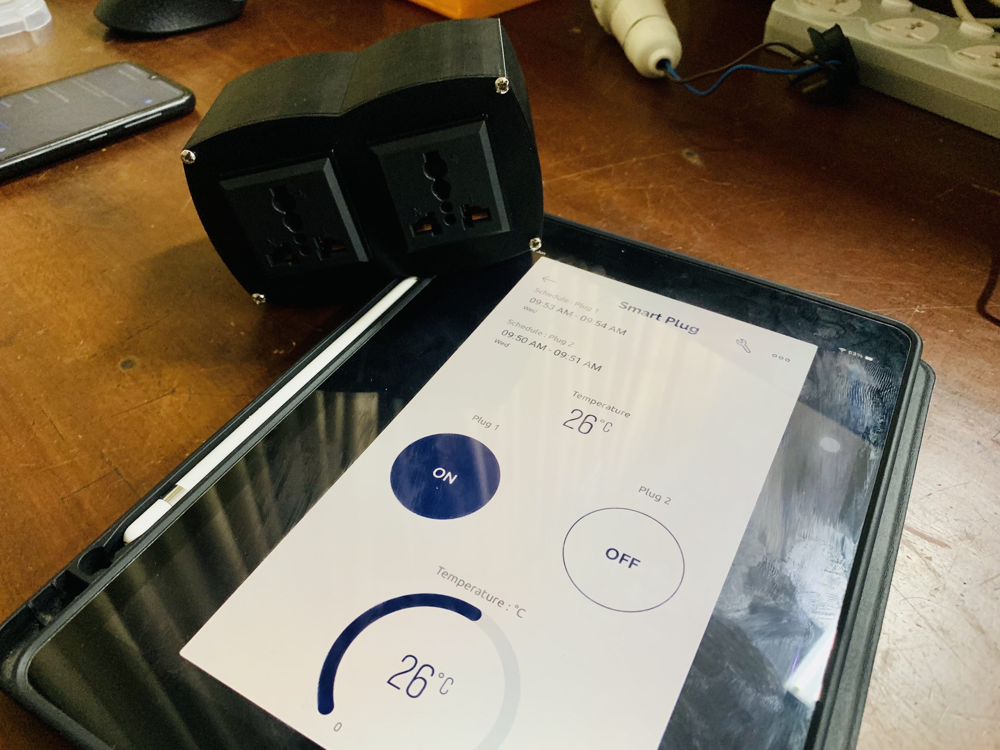
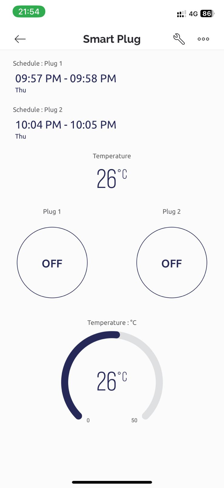
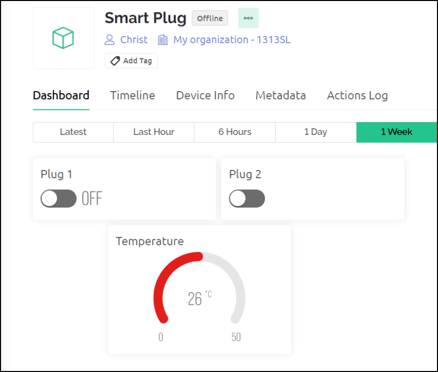
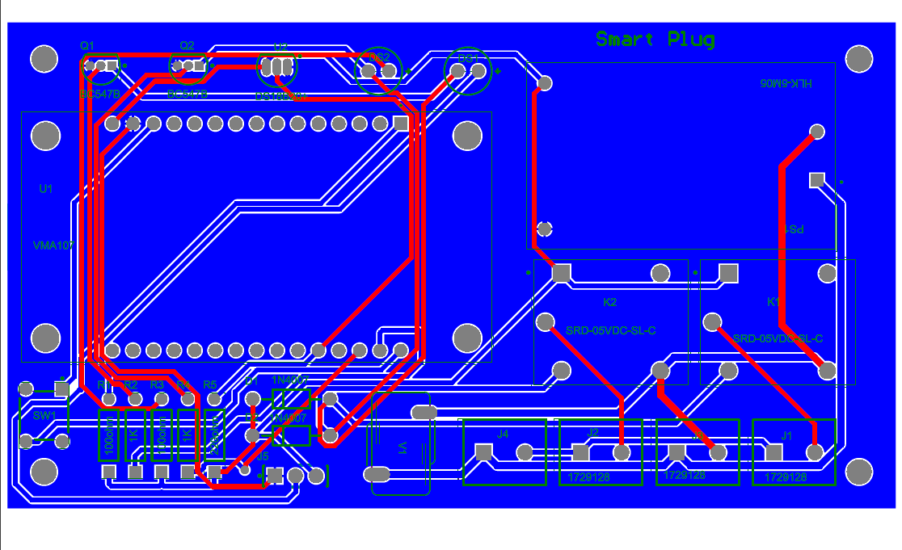
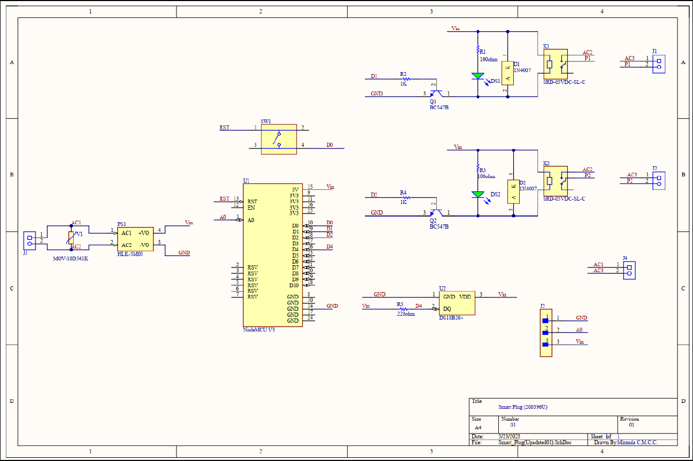

# Smartie - Smart Plug Socket

This repository contains the details of **Smartie**, an innovative smart plug developed as part of the Semester 4 EN2160 Electronic Design Realization module. Smartie combines convenience, energy management, and safety features to create a versatile addition to any smart home setup.

  

## Product Architecture

  

---

## Features

The **Smartie** smart plug offers a variety of advanced features designed for modern smart homes:

### 1. Wireless Control
Effortlessly manage devices and appliances remotely through a user-friendly mobile or web application. Whether at home or on the go, you can turn devices on or off with just a tap or click.

### 2. Temperature Monitoring
Keep track of the surrounding temperature in real-time via the mobile or web application. Monitor fluctuations and ensure optimal operating conditions.

### 3. Automatic Heating Protection
Ensure safety with the built-in heating protection feature. If the smart plug detects unusually high temperatures, it automatically cuts off power to the connected device to prevent hazards.

### 4. Time Scheduling
Set specific schedules for devices to operate automatically. From turning on the coffee maker in the morning to powering off devices at night, the scheduling feature helps save energy and simplifies daily routines.

---

## Purpose and Intended Usage

### 1. Remote Device Control
Control devices and appliances from anywhere using the mobile or web application. Turn devices on or off and monitor their status remotely, providing unparalleled convenience.

### 2. Energy Management
Optimize energy consumption by scheduling device usage. Reduce unnecessary power usage, lower utility bills, and contribute to a sustainable lifestyle.

### 3. Safety and Protection
Prevent overheating and electrical accidents with automatic heating protection. The plug continuously monitors the temperature and cuts off power when necessary, ensuring a secure environment.

---

## Target Users

- **Students**: Ideal for dormitories or apartments to efficiently manage devices and energy usage.
- **Homemakers**: Simplify daily routines and promote energy-saving practices.
- **Travelers**: Monitor and control home devices remotely for security and convenience.
- **Elderly or Disabled Individuals**: Increase accessibility and enable effortless device control.

---

## Mobile Application Specifications

The Smartie mobile application, powered by **Blynk 2.0**, enables seamless control and advanced functionality:

- Real-time remote control of devices.
- Temperature monitoring for safety and comfort.
- Automatic heating protection integration.
- Customizable time scheduling to optimize energy usage.

The application works in tandem with the **ESP8266 NodeMCU** and provides an intuitive interface for easy management of connected devices.

  

---

## Web Application Specifications

The Smartie web application, also powered by **Blynk 2.0**, extends device control to desktop or laptop browsers:

- Effortless control and monitoring of devices.
- Real-time status updates, temperature monitoring, and scheduling.
- Feature parity with the mobile application for a consistent user experience.

  

---

## Technologies Used

- **ESP8266 NodeMCU**: Microcontroller for smart plug operation.
- **Blynk 2.0**: Platform for mobile and web application integration.
- **Temperature Sensor**: Monitors real-time temperature for safety features.

---
## Enclosure and PCB Designs

### Enclosure Design

  

  

### PCB Design

  

  

### Schematics Design

  

---

## Conclusion

Smartie represents a significant step towards smarter and safer homes. With its innovative features, seamless control options, and focus on energy efficiency, it provides users with convenience, safety, and cost savings.

---
